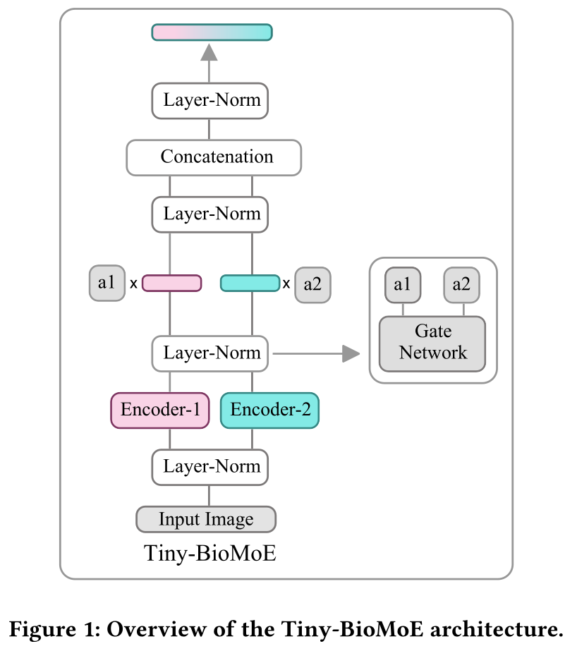
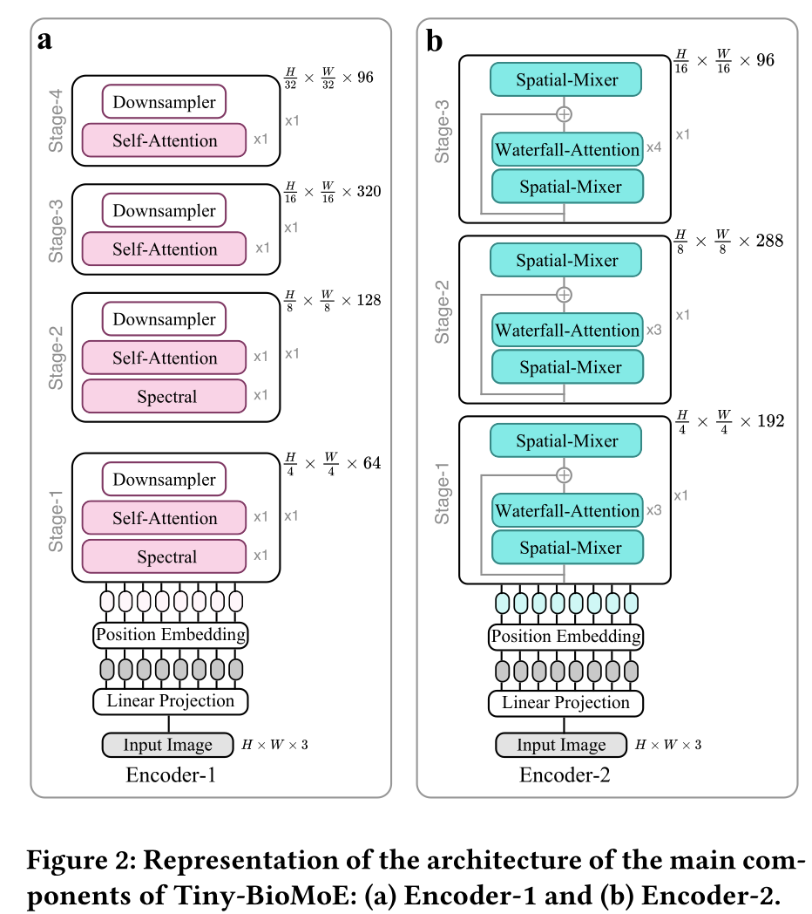

# Tiny‑BioMoE

a Lightweight Embedding Model for Biosignal Analysis

> **Tiny‑BioMoE v1.0** · **7.34 M parameters** · **3.04 GFLOPs** · **192‑D embeddings** · **PyTorch ≥ 2.0**

---

## Highlights

| Feature          | Description                                                                    |
|------------------|--------------------------------------------------------------------------------|
| **Compact**      | <8 M parameters – runs comfortably on a laptop GPU / modern CPU                |
| **Cross‑domain** | Robust across ECG, EMG, and EEG modalities – trained on 4.4 M representations  |


<br/>

<p align="center">
  
  &nbsp;
  
</p>

<p align="center"><b>Figure&nbsp;1.</b> Overall Tiny‑BioMoE architecture (left) and the two expert encoders (right).</p>

---

## Table of Contents

1. [Pre‑trained checkpoint](#pre-trained-checkpoint)
2. [Quick start](#quick-start)

   * [Extract embeddings](#extract-embeddings)
3. [Fine‑tuning](#fine-tuning)
4. [Citation](#citation)
5. [Licence & acknowledgements](#licence--acknowledgements)

---

## Pre‑trained checkpoint

Get the weights from the **[GitHub Releases page](https://github.com/GkikasStefanos/Tiny-BioMoE/releases)**.

| File              | Size      |
| ----------------- | --------- |
| `Tiny-BioMoE.pth` | **89 MB** |

```bash
# download the latest checkpoint
auto=https://github.com/GkikasStefanos/Tiny-BioMoE/releases/latest/download/Tiny-BioMoE.pth
curl -L -o Tiny-BioMoE.pth "$auto"
```

> Verify the file if you wish:
>
> ```bash
> sha256sum Tiny-BioMoE.pth
> ```

The checkpoint contains **only one key**:

```text
model_state_dict    # MoE backbone weights (SpectFormer‑T‑w + EfficientViT‑w)
```

---

## Quick start

> Assumes **PyTorch ≥ 2.0** and **timm ≥ 0.9** are already installed.

### Extract embeddings

```python
import torch
from PIL import Image
from torchvision import transforms
import architectures.spectformer   # registers SpectFormer‑T‑w
import architectures.efficientvit  # registers EfficientViT‑w
from timm.models import create_model

# ------------------------------------------------------------------
# Build backbone ----------------------------------------------------
# ------------------------------------------------------------------
class MoE(torch.nn.Module):
    def __init__(self):
        super().__init__()
        m1 = create_model('spectformer_t_w'); m1.head = torch.nn.Identity()
        m2 = create_model('EfficientViT_w');  m2.head = torch.nn.Identity()
        self.m1, self.m2 = m1, m2
    def forward(self, x):
        z1 = self.m1(x)[0]  # 96‑D
        z2 = self.m2(x)     # 96‑D
        return torch.cat((z1, z2), 1)  # 192‑D

ckpt  = torch.load('Tiny-BioMoE.pth', map_location='cpu')
model = MoE(); model.load_state_dict(ckpt['model_state_dict']); model.eval()

tr   = transforms.Compose([transforms.Resize((224,224)), transforms.ToTensor()])
img  = tr(Image.open('img.png').convert('RGB')).unsqueeze(0)
feat = model(img).squeeze().numpy()
print(feat.shape)  # (192,)
```

---

## Fine‑tuning

Integrate the backbone into any training loop:

```python
import torch, torch.nn as nn
from timm.models import create_model
import architectures.spectformer, architectures.efficientvit

class MoE(nn.Module):
    # same as above
    ...

backbone = MoE().to('cuda')
ckpt = torch.load('Tiny-BioMoE.pth', map_location='cpu')
backbone.load_state_dict(ckpt['model_state_dict'])

# freeze or unfreeze
for p in backbone.parameters():
    p.requires_grad = False  # set True for full fine‑tuning

head = nn.Sequential(nn.ELU(), nn.Linear(192, num_classes)).to('cuda')
optimizer = torch.optim.Adam(list(head.parameters()) + list(backbone.parameters()), lr=1e‑3)
```

---

## Citation

```bibtex
@inproceedings{gkikas2025tinybiomoe,
  title     = {Tiny‑BioMoE: a Lightweight Embedding Model for Biosignal Analysis},
  author    = {Stefanos Gkikas and Ioannis Kyprakis and Manolis Tsiknakis},
  booktitle = {Proc. ACM ICMI},
  year      = {2025},
  doi       = {10.1145/XXXXXXX.XXXXXXX}
}
```

---

## Licence & acknowledgements

* Code & weights: **MIT Licence** – see [`LICENSE`](./LICENSE)
* Built on open‑sourced **SpectFormer** and **EfficientViT**

---

### Contact

For issues or questions, open a GitHub issue or email **Stefanos Gkikas** ([gkikas@ics.forth.gr](mailto:gkikas@ics.forth.gr)).
